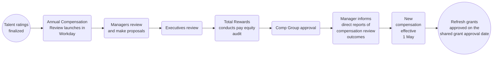

_**The information below is general information regarding the Annual Compensation Review (ACR). For up to date information, please refer to the Loop.**_

## Introduction

If you have any feedback or questions about Annual Compensation Review, please contact [HelpLab](/handbook/business-technology/enterprise-applications/guides/helplab-guide).

## Annual Compensation Review

The purpose of the Annual Compensation Review is to provide managers with the opportunity to reflect on team members' accomplishments, measure achievements against goals, and reward for demonstrated performance and growth potential.

Compensation decisions are based on:

1. Individual factors such as talent assessments outlining performance and growth potential in the role.
1. Internal assessment of our roles and compensation within teams and departments
1. Other factors includes company performance and available budget, local pay practices and regulations, and eligibility as outlined below

### Process overview

### Eligibility

Eligible team members for Annual Compensation Review have a hire date on or before:

- January 31st to be eligible to participate in the merit review program
- October 5th to be eligible to participate in the equity refresh program

Team members on leave will be eligible to receive an annual compensation and/or promotion increase during the GitLab-paid portion of their leave. If a team member is not receiving pay from GitLab, then they'll be eligible to receive the increase when they return to work.

Additionally, Team Members who receive a promotion as part of the FY26 Promotion Cycle will be eligible for the Annual Compensation Review process (including merit and equity).

Eligibility for review does not guarantee an increase will be awarded. Awards are recommended in alignment with team members’ contributions to the organization (as assessed during Talent Assessment) as is aligned to our pay-for-performance philosophy.

### Budget

Our annual cash compensation review budget for FY27 is funded at 3.5% of TTC (Total Target Cash) for all countries except for India which is funded at 7% to better align to market.

#### Merit

Merit budget will be allocated for all compensation planning managers. Each division leader is responsible for making sure their group stays within budget.

If you are a manager with other managers reporting to you, you will see your overall budget including any budget that rolls up into you in the Organization Summary screen. The overall budget will also reflect when reviewing the planning grids for managers that report to you. When you edit your own planning grid, it will show you the budget for just your direct reports.

#### Equity

Equity refresh budget is typically held at the Dir+ level, however, if there are groups where there are few team members, the equity planner may be a Senior Director or above level in order to allocate budget more efficiently. Managers below the Director level will not have an equity budget nor will they be able to plan for equity on the Stock tab in Workday. However, managers should still discuss recommendations for equity awards with their Directors to help inform recommendations as appropriate.

### Annual Compensation Review Timeline

**Please refer to The Loop for up to date timelines and guidance.**
