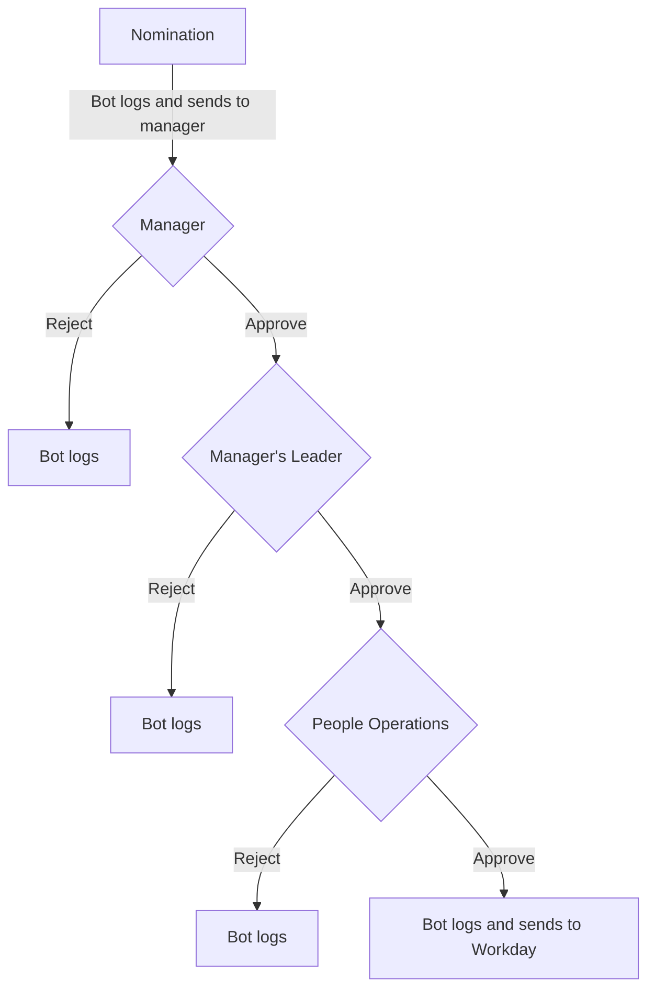

Can't find what you're looking for? Try the main [People Operations page](/handbook/people-group/).

The following incentives are available for GitLab team members. Also see our separate page on [benefits](/handbook/total-rewards/benefits/) available to GitLab team members.

## Compensation for Acting and Interim Roles

Effective Q2 of FY 2021, we have established a one time bonus payment process for team members that are asked to step into an acting or interim management role. Team Members in an acting or interim management role should review [the expectations of an individual in the management group](/handbook/company/structure/#management-group).

### Criteria for Eligibility

* For an interim role to be considered, the need for coverage would need to be longer than a 30 day time period.
* The interim role has to be at a higher level than the current role of the team member.
  * If a team member assumes 100% of the workload of a lateral role for 60 days or more **in addition to their permanent full time role,** an interim bonus may be considered by the [People Business Partner](/handbook/people-group/people-business-partners/#people-business-partner-alignments) and leader of the group.
  * Effective 2023-02-01, interim bonuses in Go-to-Market roles (CRO Organization, Sales Development) will be available to people managers temporarily occupying a lateral or higher management position **in addition to their permanent full time role.**
* In case the interim role is within another job family, team members will also be eligible for the interim compensation on a lateral level.

**Since Acting roles do not typically end in promotion, the decision on whether the acting role meets the eligible criteria rests with the Hiring Manager and the Department head.**

### Calculation of Interim Bonus

The formula for the bonus recognizes the length of time that the team member is playing the interim role. Payment of the one time bonus would occur at the completion of the interim role. The bonus would be calculated using the following formula:

The greater value of the standard discretionary bonus amount ($1,000 at the current exchange rate) OR the following calculation:

For team members on a base salary compensation plan, your bonus will be an additional 10% of your salary for the duration of the interim role period. The calculation is as follows:

* `(Annual Base Salary in Local Currency/365) x .10 (10%) x # of Calendar Days in the Interim Role`

For team members on an OTE (On Target Earnings) compensation plan in Go-to-Market roles, interim compensation will generally be based on results achieved by the interim team in the interim period:

* Interim leaders will dotted-line manage the new team, meaning they will not assume direct management of the team in Workday, but will instead act as a temporary leader. As such, quotas will not change during the interim period.
* When interim managing a lateral team:
  * The interim bonus will be calculated based on Net ARR closed during the period x a representative BCR (base commission rate), calculated based on the leader's OTI and the interim role's annual quota
* When interim covering for a higher leadership position:
  * The interim bonus will be calculated based on Net ARR closed during the period x a representative BCR (base commission rate) for the higher leadership position
* Standard commissions payments will continue for the duration of the interim role
* All in-plan (within OTI) components are eligible to be included in an interim bonus calculation for a GTM role, e.g. Net ARR, New Logo, Professional Services Bookings, etc.
* For teams measured on pooled compensation plans (e.g. SAs and CSMs), interim bonuses will be based on OTE for the interim role while in seat instead of performance: (Annual OTE in local currency/365) / x .10 (10%) x # of Calendar Days in the Interim Role
* All people managers in GTM roles are candidates for interim management assignments, outside of members of the CRO or CMO leadership teams, i.e. direct reports of the CRO or CMO
* Total bonus payments for GTM team members in an interim management role shall not exceed $50,000 USD for a single interim leadership assignment

**The interim bonus should be calculated based on the team member's salary during the interim period, not the salary after the interim period.** If your compensation changes during the interim period (for example, relocation, country conversion, etc.), we will calculate the interim bonus based on the pay rate of each calendar day.

### Tracking and Submitting Interim Bonuses

#### Tracking

Interim/acting roles should be tracked in Workday, in some cases the process is initiated in Greenhouse or may also be tracked by the manager by completing a Submission of Acting Role for a Team Member [form](https://forms.gle/KdB4TBtfuHxgGLzE8).

Guidance on different processes can be found below:

| Greenhouse | Acting/Interim Tracker |
| -------- | ---------------------- |
| All interim roles that have gone through our Greenhouse interview process | Lateral acting role in the same job family |
| More senior acting/interim role in the same job family | Lateral acting roles in different job families |

Greenhouse - Acting/Interim Tracker examples:

* Engineering Manager takes on an acting role as a Product Designer
* Engineering Manager takes on another Engineering Manager role simultaneously in a different group

Workday examples:

* An Engineering Manager takes on an interim role as a Senior Engineering Manager
* A Product Manager takes on an interim role as a Senior Backend Engineer (after having gone through an interview process)

The process for tracking interim/acting roles is as follows:

1. **(For Acting)**, Managers will align with their Manager and People Business Partner and align on the following:
   * Whether the role is interim or acting
   * Whether the role is in a new job family or the same job family
   * Whether the interim/acting role is lateral or a higher level
   * The effective start date of the interim/acting period
   * Once agreed and approved, Managers will submit the [Submission of Acting Role for a Team Member form](https://docs.google.com/forms/d/e/1FAIpQLSd5CkHvcDYx6oaNzrAm8QqFZpCVLcoDrcTpaAl-cuKCUERc2A/viewform).
1. **(For Interim)** People Business Partner will submit a [Job Change - Change Job Details](https://docs.google.com/document/d/1hpPikG0STncYKamaY8XlfMTwYdoszP-0Xogvpp5hyZ4/edit?usp=sharing) request in Workday. Job title should not be changed, as compensation and job family are not altered as part of the interim/acting process. Only a modification to the team member's `Business Title` is required. This step is only done for interim positions as acting positions are not tracked in Workday.

#### Submitting

When the interim/acting period ends, the following process should be followed to submit the interim bonus request:

* **(For Acting bonuses)** The manager references the start/end dates Acting period as initially submitted through the Acting form for the bonus calculation.
* **(For Interim bonuses)** The manager references the Workday `Job` tab and clicks into `Job History` and review the 'Business Title' column to confirm the start date of the interim period
* Once confirmed, the Manager submits the bonus in Workday. Follow the [Request a One-Time Payment job-aid](https://docs.google.com/document/d/15_cqMAIoqkxNhoCTL42X3XUpr0E9fNZXFmY3Yitk2LQ/edit?usp=sharing) to submit an OTP. Manager must also provide the start and end date of the of interim period in Workday under the **Additional Information** section in Workday

**Note:** The team member must be an active team member of GitLab at the end of the interim role period to be eligible to receive a bonus payment. If a team member leaves GitLab during the interim role period, they will not be eligible for a prorated payment.

### Examples of the Interim Bonus Calculations below

* Senior Engineer has a base salary of $125,000. She has taken on the interim role of Engineering Mgr for 3 months (Jan-March) which is a total of 90 days. The bonus for this interim role would be `($125,000/365) x .10 x 90 = $3,082.19`
* Finance Business Partner has a base salary of $100,000. He has taken on an interim role covering multiple teams while his coworker is on leave for 4.5 weeks which is a total of 31 days. The bonus for this interim role would be `($100,000/365) x .10 x 31 = $849.32` so we would round up for this bonus and process as a discretionary award.
* Area Sales Manager interim manages a lateral team after a peer ASM has been promoted. The ASM has a base commission rate of 1% for Net ARR and $3,000.00 per New Logo.  During their interim coverage the Area closes $1,000,000.00 of nARR and 2 First Order new logos.  The bonus calculation would be ($1,000,000.00 x .01) + (2 x $3,000.00) = $16,000.00.
* Area Sales Manager interim manages an entire Region after an AVP leaves GitLab. AVP base commission rates are 0.3% for Net ARR and $800 per New Logo. During the interim coverage period, the team closes $5M of Net ARR and 4 New Logos. The bonus calculation would be ($5,000,000.00 x 0.003) + (4 x $800.00) = $18,200.00.

## Discretionary Bonuses

### Discretionary Bonuses for Individuals

#### Purpose

Discretionary bonuses are **peer-to-peer** recognition awards for exceptional work that goes **above and beyond role expectations** while exemplifying GitLab's [CREDIT](/handbook/values/#credit) values: :handshake: Collaboration, 📈 Results for Customers, :stopwatch: Efficiency, :globe_with_meridians: Diversity, Inclusion & Belonging, :footprints: Iteration, and :eye: Transparency.

Good and great work is our baseline — bonuses celebrate truly exceptional contributions that stand out even by that high standard.

**Award Amount:** $1,000 USD (fixed, at [current exchange rate](/handbook/total-rewards/compensation/#exchange-rates))

#### Eligibility

##### Who Can Nominate

Any GitLab [team member](/handbook/people-group/employment-solutions/#team-member-types-at-gitlab) in good standing may nominate anyone — including people outside their own team. Self-nominations are not permitted.

##### Who Can Be Nominated

Any GitLab team member **except**:

* Direct managers or anyone in your management chain
* Temporary contractors
* Team members currently in underperformance remediation
* Team members who are not in good standing or who have left GitLab

#### What Qualifies

A valid nomination must satisfy **all three** of the following:

1. **Outside normal role scope** — Would this work typically be done by someone at a higher level or in a different function?
1. **Exceptional execution** — Does it stand out even against a baseline of great work?
1. **Demonstrates CREDIT values** — Which specific values, and how?

##### Examples by Value

| **Value** | **What "Above and Beyond" Looks Like** |
|---|---|
| :handshake: Collaboration | Stepping into another function to unblock a critical deliverable |
| 📈 Results for Customers | Solving a critical customer issue entirely outside your role |
| :stopwatch: Efficiency | Implementing a solution that dramatically improves processes across teams |
| :globe_with_meridians: DIB | Creating an initiative that measurably improves belonging org-wide |
| :footprints: Iteration | Shipping incremental value when others would wait for perfection |
| :eye: Transparency | Making information accessible and visible across the organization |

##### &cross; Invalid Criteria

* Routine job responsibilities or core projects
* Meeting sales targets (covered by sales compensation)
* Working long hours (we measure impact, not hours)
* Partnering with other teams (expected collaboration)
* Doing "great" work (that's our baseline, not the bar for a bonus)

#### Nomination Process

Submit with [Nominator Bot](/handbook/total-rewards/incentives/#nominator-bot-process) with:

* Which CREDIT values were demonstrated — with concrete examples
* How the work went beyond their normal role
* Specific links or artifacts showing the work
* Measurable impact on the broader organization

**Review Steps:**

1. **Manager** — Confirms values are articulated, work is truly exceptional and outside normal role, and bonuses are being distributed thoughtfully across the team
1. **Compensation** — Review and approval
1. **People Operations** — Final review and approval; processes payment
1. **Recognition** — Shared in #thanks highlighting the values demonstrated

Nominations idle for 90+ days are automatically canceled.

### Distribution Guidance

A rough guideline: ~1 in 10 team members may receive a bonus in a given month — but this is not a quota. Bonuses should be spread thoughtfully across the team, not concentrated on the same individuals repeatedly.

#### Valid Nomination Examples

**Technical Writer as Documenation Engineer**

"X acted as a part-time documentation engineer during a critical vacancy — well beyond their writer role. They implemented Global Navigation, modernized the codebase with MVCs, and collaborated across teams for organization-wide impact." (_Values: Results, Efficiency, Collaboration_)

**Cross-Team Critical Support**

"When the backend team was unavailable, X — from a different team — stepped in to unblock a critical deploy, debugged complex issues blocking customer access, and proactively identified similar problems across other features." (_Values: Results, Efficiency, Collaboration_)

**Building Org-Wide Tooling**

"X built Nominator Bot, cutting approval time in half, managing ongoing improvements proactively, and making the entire process visible to the organization." (_Values: Efficiency, Transparency_)

#### Invalid Nomination Examples

❌ _"X helped with my onboarding and answered all my questions."_ — Expected collaboration; not exceptional or outside their role.

❌ _"X met their sales quota for three months."_ — Core to their role and covered by sales compensation.

❌ _"X always helps teammates at the last moment."_ — Expected collaboration with no specific exceptional contribution.

Questions? Reach out to People Operations or post in **#people-connect**.

### Process for Recommending a Team Member for a Discretionary Bonus

**Note:** Kindly use Nominator Bot for discretionary bonus requests instead of Workday.

#### Nominator Bot Process

##### Any GitLab team member

1. Go to Slack and type `Nominator` in the search bar and select the Nominator App
1. Click the 'Nominate!' button to add details about the nomination. Use the text fields to write a few sentences describing how the GitLab team member has demonstrated a specific GitLab value in their work.  Please make sure you have viewed the valid and invalid criteria listed above. Don't forget that the nomination request should tie to our values and be detailed enough to ensure that the nomination meets the criteria. You can select the values it applies to.
1. If applicable, please be sure to include any relevant issues or merge requests that support the nomination.
1. Once submitted, the bot will send this over to the manager to kick-off the approval flow.
1. If at any point in the approval flow the manager or the manager's manager has a question about approving the bonus they can reach out to the manager and/or nominator for more context. If they have remaining questions related to the process and logistics (e.g., where is the bonus in the approval chain?), this [FAQ guide](https://theloop.gitlab.com/site/4455aa7f-24d9-41f2-b940-467b54962e4d/page/0fa19bf4-fd6a-41b9-9316-c2dcf3add854) could help clarify, alternatively they can reach out to the People Operations team via [HelpLab](https://helplab.gitlab.systems/esc?id=emp_taxonomy_topic&topic_id=e7b7f30d474c069067429ee0026d431f). For remaining questions regarding guidance on whether to approve a nomination, they can reach out to their aligned [People Business Partner](/handbook/people-group/people-business-partners/#people-business-partner-alignments).
1. If the manager or second level approver is on an extended leave and unable to respond to the nomination in a reasonable timeframe (more than 2 weeks), please create a case for the People Operations team in [HelpLab](https://helplab.gitlab.systems/esc?id=sc_cat_item&sys_id=ff7a26094784069067429ee0026d4337) with who the nomination is for, so it can be manually moved to the next level manager to be processed.
1. Once everyone has approved the bot will report back to you with the good news. If it's rejected we ask the person who rejects, to reach out to you. That is not done by the bot.

##### Manager Process

1. The Nominator bot will send you a Slack DM asking to approve or reject the nomination.
1. When you decide to approve, all you need to do is click the approve button. The bot will take care of the next steps (sending it to the second level manager and the People Operations team).
1. When you decide to reject, click the reject button. The nomination will be updated as `rejected_by_manager`. The bot will ask you to reach out to the nominator as to make sure they understand why the nomination was not approved.
1. If the next level approver is on an extended leave and unable to respond to the nomination in a reasonable timeframe (more than 2 weeks), please create a case for the People Operations team in [HelpLab](https://helplab.gitlab.systems/esc?id=sc_cat_item&sys_id=ff7a26094784069067429ee0026d4337) with who the nomination is for, so it can be manually moved to the next level manager to be processed.
1. When everyone else has approved, the bot will reach out to you so you can share this with the team member, in the [#thanks](https://gitlab.slack.com/archives/C038E3Q6L) Slack channel, and make sure the team member's direct peers can easily see it:
    * For example, cross-post to the team member's group channel
    * For Support, add it to the [Support Week in Review](/handbook/support/#support-week-in-review) as a "Team Member Update" item

##### Approval flow



### Working Group Bonus

1. Sometimes a [working group](/handbook/company/structure/#working-groups) strongly displays GitLab Values over a period, project or situation. For this case, use the  Working Group Bonus.
1. As with individuals, we recognize those who make up that group through the `#thanks` channel and sometimes through a Working Group Bonus.
1. Anybody can [recommend a Working Group Bonus](#process-for-recommending-working-group-bonus-in-workday) through the managers of the individuals involved for $100 per person at [the exchange rate](/handbook/total-rewards/compensation/#exchange-rates).

### Process for Recommending Working Group Bonus in Workday

**Any GitLab team-member**

1. Write a description of how the working group has demonstrated a specific GitLab value in their work.
1. Email that sentence to the managers of the individuals, suggesting a Working Group Bonus, and set-up a 15 minute Zoom meeting with all the managers to discuss your proposal. **Note: The alignment with managers can also be done asynchronously in a private Slack channel.**
1. Remember that the manager(s) may or may not agree and they have full discretion (with approval of their manager) on whether their reports get a bonus.  Don't forget that you can also use the `#thanks` channel to recognize people, as well.

**Sales Development Focus Bonus (Sales Development specific working bonus)**

1. Sometimes a working group strongly displays GitLab Values over a period, project or situation. For this case, we have a  Working Group Bonus. The requirements for the sales development teams can vary from month to month and therefore may require a special focus from one or a group of individuals to complete  specific tasks.  Examples include: Adoption of a new process, driving new behaviors or special focus on a specific prospecting task from the sales team. This bonus is not an  income supplement or an incentive for the team to do their current job, but to reward extra effort.
1. The Focus Working Group Bonus can only be recommended by Sales Development Managers for individuals or a group of individuals within their teams. The budget for the focus bonus cannot exceed $500 monthly for any Sales Dev Team and will typically be divided amongst team members.

**Manager Process**

1. Please submit as a [One Time Payment](https://docs.google.com/document/d/15_cqMAIoqkxNhoCTL42X3XUpr0E9fNZXFmY3Yitk2LQ/edit) in Workday. Make sure to write in the `Additional Information` box what the working group bonus is for.

**Approval Process:**

1. The next level Manager receives an alert from Workday and can approve or deny.
1. Once approved by the next level manager, the request is sent to People Operations for review and final approval.
1. Once fully approved, Payroll is notified of the bonus and can begin processing.
1. After this, the manager is able to notify the team member of the bonus and will announce it on the GitLab Slack channel `[#thanks](https://gitlab.slack.com/archives/C038E3Q6L)`. The announcement should include the "who" and "why" of the bonus.

### Communicating Discretionary Bonuses

As a general rule, the nominated team member's direct manager should be the only person who communicates discretionary bonuses. The manager will receive final notification via the nominator bot and will know when the nomination has gone through all levels of approval.

The exception to this rule could be for working group bonuses if a single person nominated a group. If the nominator would like to announce on behalf of the group, they should:

* **Confirm that all bonuses have gone through all layers of approval**
* Confirm with each nominees direct manager that it is ok for them to announce on behalf of the group

### Discretionary bonus reporting

On a quarterly basis there's a review of the discretionary bonuses data. This includes: # approved per manager, # rejected per manager and any trends on the reason for rejection. This way we can act on any trends and ensure an efficient and consistent process across the whole organization.

## GitLab Awards Program

Each fiscal year the GitLab Awards program recognizes team members who made great impact as a result of displaying our [Values](/handbook/values/#credit). The GitLab Awards Program consists of two different types of awards: The DZ Award and Values Awards.

### The DZ Award

In honor of our valued co-founder, [Dmitriy Zaporozhets "DZ"](https://university.gitlab.com/learn/video/dz-video), his contributions and him dedicating 10 years to GitLab, GitLab recognizes a team member each fiscal year who made a great impact solving a hard problem by using a [boring solution](/handbook/values/#boring-solutions).

The DZ award details:

* The recipient of The DZ award will receive a one time cash bonus equivalent to $10,000 USD at using the local exchange rate. This is designed to honor DZ's 10 years of contributions to GitLab and the recipient's role in continuing DZ's legacy.
* Special designed GitLab Award and Headphone Stand

#### Criteria for The DZ Award

Potential nominees should be any team members who solved a challenging problem by creating and implementing a [boring solution](/handbook/values/#boring-solutions) that resulted in a positive and profound impact.

**Criteria used to calibrate:**

* OKR results and outcomes
* Significant business result/impact from the boring solution in this Fiscal Year.
* Contributions outside the general scope of the role (e.g. this award would not be granted for business as usual boring solutions)

**Criteria not used to calibrate:**

* The team member holding a technical role or creating a solution to a technical problem is not a requirement to be nominated for this award.
* Level within the business - this award is not intended to be granted to only leaders, but instead available to all team members.
* [Talent Assessment](/handbook/people-group/talent-assessment) - while we want to ensure we continue our pay for performance compensation philosophy, team members can be eligible for this award regardless of the output of the last review cycle.
* The only criteria is that the team member would need to be in good standing (e.g. not on a PIP/recently received a Written warning).

### The Values Awards

The Values Awards honor those who embody and employ the GitLab values which are fostering an environment where everyone can thrive. These awards specifically recognize team members who are inclusive with all team members in their diversity of thought and perspectives. Team members eligible for these awards demonstrate: no ego in the workplace, use a single source of truth, saying why not just what, and embracing uncomfortable ideas and conversations. The contributions or displays of the GitLab Value should be visible beyond the team member's direct team, customers, users or investors.

The Values Awards details:

* There are six awards, one for: Collaboration, Results, Efficiency, Diversity, Inclusion and Belonging, Iteration and Transparency.
* The recipient of each value award will receive a one time cash bonus equivalent to $5,000 USD at the exchange rate.
* Special designed GitLab Awards medal.

#### Values Award Descriptions

##### Collaboration Award

To achieve results, team members must work together effectively. The value award for [Collaboration](/handbook/values/#collaboration) should be awarded to a team member that made helping others a priority and went above and beyond in ways that led to tangible results. This can come in the form of for example: giving feedback effectively, sharing, reaching across company departments or short toes.

##### Results Award

We do what we promised to each other, customers, users, and investors. The value award for [Results](/handbook/values/#results) should be awarded to a team member that went above and beyond to get to significant results for a company wide impact. This can come in different forms through for example: ownership, perseverance, dogfooding or disagree, commit, and disagree.

##### Efficiency Award

Working efficiently on the most important business initiatives enables us to make fast progress, which makes our work more fulfilling. The value award for [Efficiency](/handbook/values/#efficiency) should be awarded to a team member that helped make fast progress through for example championing writing things down, embracing change or being a manager of one.

##### Diversity, Inclusion & Belonging Award

We aim to make a significant impact in our efforts to foster an environment where everyone can thrive. The value award for [Diversity, Inclusion and Belonging](/handbook/values/#diversity-inclusion) should be awarded to a team member that contributed to creating an environment where people from every background and circumstance feel like they belong and can contribute through for example: their bias towards asynchronous communication, seeking diverse perspectives or embracing neurodiversity.

##### Iteration Award

We do the smallest thing possible and get it out as quickly as possible. The value award for [Iteration](/handbook/values/#iteration) should be awarded to a team member that contributed or displayed iteration that led to faster results through for example: setting a due date, minimal valuable change (MVC) or low level of shame.

##### Transparency Award

By making information public, we can reduce the threshold to contribution and make collaboration easier. The value award for [Transparency](/handbook/values/#transparency) should be awarded to a team member that contributed or displayed transparency through for example: determining what is not public, use of a single source of truth and saying why not what.

#### Criteria for value awards

* Significant contribution or display of GitLab Value in this Fiscal year.
* The contribution or display of GitLab Value led to tangible results.
* The contribution or display was visible to team members outside of their direct team, customers, users or investors.
* Contribution or display was outside the general scope of their role/Job Family responsibilities
* ​​Truly exceptional work. Good and great is already expected in a team member's work and performance
* Team member is in good standing with the company (e.g. not on a PIP/recently received a Written warning).

### Nomination process for awards

All team members can make nominations for both The DZ Award and Values Awards. When you submit a nomination, the People Communications & Engagement DRI will create a document looping in your manager and Department Head. Ultimately each Department Head can bring forward 1 nomination for the DZ Award and 1 nomination per value. The Department Head should loop in their People Business Partner to review the final nominations. The People Communications and Engagement DRI will coordinate the nominations for both awards and ultimately nominations will be calibrated at the E-Group level.

#### Overview of the nomination process

* When the nomination window opens all team members can submit both Values Award and DZ Award nominations through [this form](https://forms.gle/euX4hSmcpcwvfCPR8).
* The People Communications and Engagement DRI will create a document looping in the nominator's manager and Department Head to review the nomination.
* When the nomination window closes the People Communications and Engagement DRI will ensure all nomination documents are completed before calibration.
* The People Communications and Engagement DRI and People Business Partners will then calibrate between department nominations with the E-group leader to select one team member nomination for The DZ Award and up to one team member per Value for the Values Awards.
* Engineering and Sales will be able to nominate two team members for The DZ Award.
* The nominations are finalized and E-group will discuss the nominees from each group and select the award winners.
* The award winners will be announced.

## CTO DevSecOps Innovation Award

The DevSecOps Innovation Award is a recognition program for GitLab team members who are leveraging our platform and its features to improve the productivity and effectiveness of how they approach their day-to-day work. **Dogfooding** our product is critical to learning how to improve the product, not just for ourselves but also for our customers. By understanding our internal use of the product, we can enhance both our productivity and our ability to market and promote the platform to others.

More details about this award can be seen on the [internal handbook page](https://internal.gitlab.com/handbook/engineering/cto-programs/cto-devsecops-innovation-award/).

## Referral Bonuses

Chances are that if you work at GitLab, you have great friends and peers who would be fantastic additions to our [Team](/handbook/company/team/) and who may be interested in joining our team. To help us grow with exceptional people, we have a [Referral Bonus](/handbook/hiring/referral-process/) that work as follows:

* We offer a referral bonus once the new team member has been employed with the company for 3 months.
* In the past, we had a tiered system of referral bonuses, but we've simplified the structure to add a flat bonus amount.
* [$1,500](/handbook/total-rewards/compensation/#exchange-rates) base referral bonus for a new hire.

### Q4 Account Executive Referral Incentive (December 8, 2025 - February 23, 2026)

During this limited period, referral bonuses for Account Executive positions will be increased to:

* $7,000 for referrals hired to Commercial or New Business Account Executive roles
* $10,000 for referrals hired to Strategic or Major Account Executive roles
These enhanced bonuses apply to any Account Executive referral with a hire date between **December 8, 2025, and February 23, 2026**, and will follow all company referral and payout policies.

We encourage and support [diversity](/handbook/values/#diversity-inclusion) on our team and in our hiring practices and encourage team members to consider whether there are potential candidates in their networks who identify as members of underrepresented groups in tech.

Please note if the team member has a hire date effective **before 2025-12-07**, then the [previous](/handbook/hiring/referral-operations/#adding-a-referral-to-workday-people-operations-team) mentioned referral bonus amounts apply.

### How to make a referral

For information regarding the program details and team member eligibility and understanding, please visit our [guide in the Hiring section of GitLab's handbook](/handbook/hiring/referral-process/).

### Exceptions

* no bonus for hiring people who report to you directly or are in your direct reporting chain,
* no bonus if you refer current team members,
* no bonus for referring a Boomerang Team Member (returning team member),
* no bonus if the referring Team Member is a part of the Talent Acquisition team - they are not eligible given the nature of their position is to engage candidates.
* no bonus if there's a perceived conflict of interest.
* no bonus for VP level or the [Executive Group](/handbook/company/structure/#executives).
* no bonus if the referral is an intern. You will be paid a referral bonus if the referral(intern) is converted to a full-time, intermediate-level team member.
* no bonus for a referring team member will be applicable if the team members employment is terminated prior to the referral bonus payout date. You need to be an active team member.
* In the event that more than one GitLab employee refers the same team member for the same role the People Ops team will ask the new team member to confirm who they were referred by (who should get the credit). If they mention two or more people then the bonus will be split between them.
* In the event that someone wants to refer another candidate to GitLab before they have started, the referring party must have a signed contract at the time of the new candidate's application.
* In the event that a GitLab sourcer adds a candidate to GreenHouse and the recruiter screens the candidate a referring party cannot be added to their profile after. The candidate source would be Prospecting by the GitLab sourcer.

### Referral Bonus Processing

1. The People Operations team processes referral bonuses weekly out of the GitLab Referral Bonus Audit Workday report
1. One Time Payments are added to Workday after reviewing the report and ensuring all qualifications have been met
1. Payroll is notified of the completed bonus and can begin processing

### Temporary Add-on Campaign additional tracking for payout

1. Talent Acquisition Manager will track all referrals set to hired in the time period of Add-on campaign.
1. Talent Acquisition Manager will notify People Operations by HelpLab or email, the first of the month that aligns with the referred new hire's 3 month employment at GitLab.
1. People Operations will follow the [steps outlined above](#referral-bonus-processing)

### GitLab Anniversaries

At 10:00 UTC on Thursday of every week, `PeopleOps Bot` slack bot will send a shout out on the `#team-member-updates` channel congratulating all team members who celebrates a hire date anniversary that week.
Visit our [GitLab Anniversary Gift](/handbook/people-group/celebrations/#anniversary-gifts) section for more information about the gifts.

## GitLab Ultimate with Duo Enterprise

Every GitLab team member can request the [Ultimate](https://about.gitlab.com/pricing/#gitlab-com) tier for GitLab.com.
In case a team member has separate private and work accounts on GitLab.com, they can request it for both. This incentive **does not** apply to groups owned by GitLab team members (Group-level Ultimate features such as epics will not be available for Ultimate GitLab team-member personal accounts, for instance).

In order to request Ultimate, please [submit this form](https://docs.google.com/forms/d/e/1FAIpQLSddexI8VZTCiyxme1_7QtbQZ6WoIJRlHdaI2Gi6PD8Eti-DLQ/viewform). Your account(s) will be upgraded to the Ultimate tier within 2 hours of submission.

{}

There isn't an easy way to confirm you're on the Ultimate plan from your GitLab profile nor account info page. To confirm you have the Ultimate Plan for a particular account:

* sign in to Gitlab.com with your account
* browse to https://gitlab.com/api/v4/namespaces/{username} (replace `{username}` with your actual GitLab username)
* in the page contents you should see the text below if your account is on the Ultimate plan:

  ```json
  "plan": "ultimate",

{}

If you have questions about this process or don't see this upgrade after 2 hours (after having checked using the steps above), please reach out in the [`#it_help` GitLab slack channel](https://gitlab.slack.com/archives/CK4EQH50E).

Additionally, GitLab team members can request a single seat Ultimate plan group with [Duo Enterprise](https://about.gitlab.com/gitlab-duo/#addons) for a single group on their personal account (the same account used for the Ultimate tier request above) by using the [`GitlabCom_Licensed_Demo_Group_Request` issue template](https://gitlab.com/gitlab-com/team-member-epics/access-requests/-/issues/new?type=ISSUE&description_template=GitlabCom_Licensed_Demo_Group_Request).

These options are provided to encourage using all our features whenever possible as part of [dogfooding](/handbook/values/#dogfooding) our product.

Ultimate and Duo Enterprise will be removed from all relevant namespaces as part of offboarding.

The ownership of intellectual property (IP) created during your time as a GitLab team member is governed by your employment agreement. Choosing to develop and host this IP on a personal GitLab account that benefits from this incentive does not determine whether the IP is subject to your employment agreement's invention assignment provisions.
